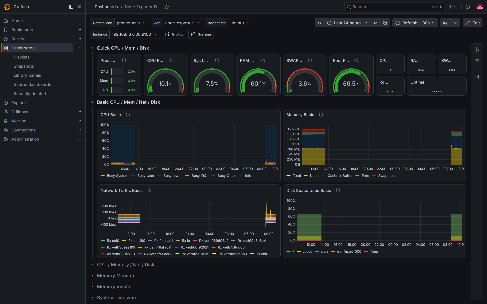
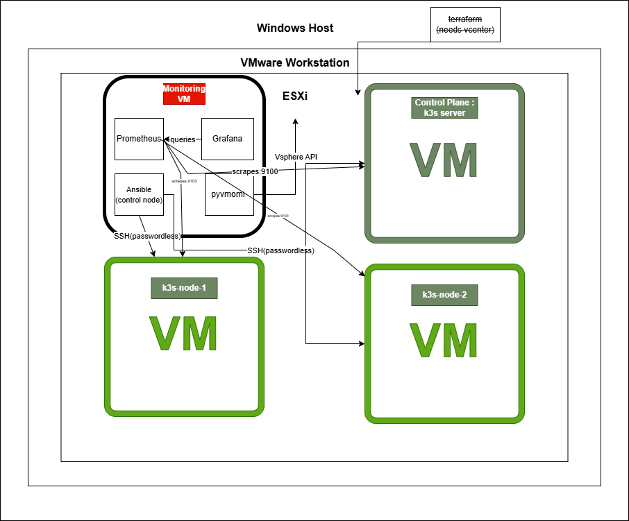

# vSphere + k3s Observability Lab

A self-hosted virtualization, orchestration, and observability lab built to explore how a VMware vSphere environment, a lightweight Kubernetes cluster, and a full monitoring stack fit together, end to end.



## Context

This project started during an internship at **Société Monétique Tunisie (SMT)**, Tunisia's national interbank switching company. The internship came without an assigned project or access to production systems ,a reasonable constraint, given SMT's environment runs live banking infrastructure (a VMware vSphere/ESXi stack of roughly 600 VMs, monitored via SolarWinds).

Rather than wait for direction, I built a self-contained lab mirroring the same architectural pattern — hypervisor, orchestration, monitoring  on my own hardware. The goal was to actually understand the full stack hands-on, not just watch it exist.

**Note on this README:** I used AI (Claude) to help organize and structure this document — deciding what to cover and how to lay it out  and also for some parts of the project like `aws-cost-mapping` and the Ansible playbooks. The content itself — the architecture, the decisions, the debugging, the code  is mine, built and tested on infrastructure I set up and run myself on my personal device.

## Architecture



**Stack summary:**
- **Host:** Windows 11 → VMware Workstation Pro → nested ESXi 7.0.3 (evaluation license, standalone — no vCenter)
- **5 VMs on ESXi:**
  - `ubuntu` — k3s control-plane
  - `k3s-node-1`, `k3s-node-2` — k3s workers
  - `monitoring` — Prometheus, Grafana, Alertmanager (via Docker Compose), Ansible control node, custom vSphere exporter
  - `windows-server` — Windows Server 2016 (Server Core), running `windows_exporter` for cross-platform validation
- **Orchestration:** k3s (lightweight Kubernetes), chosen for its small footprint given hardware constraints
- **Observability:** three independent layers feeding one Prometheus instance:
  - `node-exporter` / `windows-exporter` — system-level metrics (CPU/RAM/disk/network) across all Linux and Windows VMs
  - `kube-state-metrics` — Kubernetes object-level metrics (pod status, deployments, node conditions)
  - custom `vsphere-exporter` (this repo) — vSphere-layer metrics (per-VM CPU/memory, datastore capacity, host stats) via `pyvmomi`
- **Alerting:** Alertmanager, wired to Prometheus, sends email notifications on threshold breaches and file integrity events (see below)
- **Security monitoring:** two complementary File Integrity Monitoring (FIM) approaches — periodic hash-based scanning (AIDE) and real-time event-based watching (`inotify`) — see below
- **Automation:** Ansible (configuration management across all k3s nodes), Terraform (intended provisioning layer — see limitation below)

## Key engineering decisions

**Why k3s instead of full Kubernetes.** Given the hardware budget (24GB RAM shared across nested ESXi, guest VMs, and the Windows host), k3s's lightweight footprint made a multi-node cluster feasible at all. It's still full, production-grade Kubernetes — this mirrors how k3s is actually used in real edge/resource-constrained deployments.

**Why Terraform is present but not the active provisioning tool.** Terraform's `vsphere_virtual_machine` resource supports cloning VMs via a `clone` block — but this feature requires **vCenter Server**; it is not available against standalone ESXi, even under an evaluation license. This was discovered directly (`Error: use of the clone sub-resource block requires vCenter`) rather than assumed. The Terraform configuration is kept in [`terraform/`](terraform/) as the intended design for a vCenter-managed environment — it would work unmodified if pointed at real vCenter. In this lab, node provisioning is instead handled by [`scripts/clone_node.sh`](scripts/clone_node.sh), a POSIX shell script run directly on the ESXi host via `vmkfstools` (disk clone) and `vim-cmd solo/registervm` (VM registration) — the CLI-level equivalent of what Terraform would otherwise automate.

**Why monitoring runs externally, not in-cluster.** Prometheus and Grafana run on a dedicated VM outside the k3s cluster, via Docker Compose, rather than deployed inside the cluster (e.g. via the kube-prometheus-stack Helm chart). This keeps monitoring independent of the health of the thing it's observing — if the cluster has issues, the monitoring stack watching it isn't also at risk — and was lighter on resources for this lab's constraints.

**Why a custom exporter instead of relying only on community tooling.** `node-exporter` and `kube-state-metrics` cover the system and Kubernetes layers, but neither exposes vSphere-level state (VM power state, datastore capacity, host resource usage as seen by the hypervisor). [`vsphere-exporter/vsphere_exporter.py`](vsphere-exporter/vsphere_exporter.py) fills that gap — it connects directly to the ESXi host's vSphere API via `pyvmomi` (the same API vCenter is built on) and exposes the results in Prometheus format, giving three layers of observability: **vSphere → Kubernetes → System**.

**Why two different FIM approaches instead of one.** AIDE (periodic, hash-based, full-system scan) and `inotify` (real-time, event-driven, scoped) solve the same underlying problem — detecting unauthorized file changes — with different tradeoffs. AIDE is thorough but slower and needs careful tuning to avoid false positives; `inotify` is instant but only practical for a bounded set of paths. Having both demonstrates the two dominant models used in real FIM tooling, rather than treating "install AIDE" as the entire problem.

## Repository structure

```
├── terraform/               # Intended IaC design (vCenter-targeted; see limitation above)
├── ansible/                  # Configuration management playbooks
│   ├── inventory.ini.example
│   ├── ansible.cfg
│   ├── node_exporter.yml
│   ├── ufw_setup.yml
│   ├── fim_setup.yml         # Installs AIDE, initializes baseline, schedules periodic checks
│   ├── node_exporter_textfile.yml  # Enables node_exporter's textfile collector
│   └── ...
├── vsphere-exporter/         # Custom Prometheus exporter for the vSphere layer
│   ├── vsphere_exporter.py
│   └── vsphere-exporter.service
├── aws-cost-mapping/         # VM specs -> EC2 instance/cost estimate
│   └── cost_mapping.py
├── fim/                       # File Integrity Monitoring scripts
│   ├── aide_check.sh          # AIDE periodic check -> Prometheus textfile metric
│   ├── watch_folder.sh        # inotify real-time folder watcher -> Prometheus textfile metric
│   ├── ack_folder_alert.sh    # Manual acknowledgment/clear script for the inotify watcher
│   └── folder-watch.service
├── scripts/
│   └── clone_node.sh          # ESXi CLI-based VM cloning (standalone-ESXi workaround)
├── monitoring/
│   ├── docker-compose.yml     # Prometheus, Grafana, Alertmanager
│   ├── alertmanager/
│   │   └── alertmanager.yml
│   └── prometheus/
│       ├── prometheus.yml
│       └── alert.rules.yml
└── docs/
    ├── architecture.png
    └── screenshots/
```

## Observability stack

Prometheus scrapes four independent target types, spanning both Linux and Windows:

| Job | Source | Port | What it exposes |
|---|---|---|---|
| `node-exporter` | all 4 Linux VMs (3 k3s nodes + monitoring) | `9100` | CPU, memory, disk, network per VM |
| `kube-state-metrics` | k3s cluster (NodePort) | `30080` | Pod status, deployments, node conditions |
| `vsphere-exporter` | monitoring VM (this repo) | `9272` | VM CPU/memory, datastore capacity, host stats |
| `windows-exporter` | Windows Server 2016 VM | `9182` | CPU, memory, disk, network (Windows equivalent of node-exporter) |

Grafana visualizes all three: the community "Node Exporter Full" dashboard (ID 1860) for system metrics, a Kubernetes cluster dashboard for kube-state-metrics, and a custom-built dashboard for the vSphere layer (queries in [`vsphere-exporter/`](vsphere-exporter/)).

## Alerting

Alertmanager runs alongside Prometheus and Grafana (via Docker Compose) and sends email notifications when defined thresholds are crossed, and again when they clear.

**CPU threshold alert** (`monitoring/prometheus/alert.rules.yml`): fires when a node's CPU usage stays above a defined threshold for a sustained period (`for: 2m`, to avoid noise from brief spikes), and automatically sends a resolved email once usage drops back down (`send_resolved: true`) — no manual step needed for this one, since a CPU spike is a transient condition that resolves on its own.

Tested end-to-end using `stress` to artificially load a node's CPU and confirm both the firing and resolved notifications arrive correctly, with the alert correctly scoped to the specific node under load (via Prometheus's per-`instance` label grouping) rather than the whole fleet.

## File Integrity Monitoring (FIM)

Two complementary approaches, both feeding the same Prometheus/Alertmanager pipeline used for the CPU alert:

**1. AIDE (periodic, hash-based, system-wide)** — deployed via Ansible (`ansible/fim_setup.yml`) across all 3 k3s nodes. AIDE takes a cryptographic-hash baseline of the filesystem and re-checks it on a schedule (every 15 minutes via cron), reporting whether anything changed.

Getting this right required real tuning, not just installation:
- AIDE's default config includes an unrestricted `/ 0 Full` rule — hashing the entire filesystem, including k3s's container storage (`/var/lib/rancher`, `/var/lib/containerd`), which is both large and constantly changing. This made initial scans take 25+ minutes and produce constant false positives.
- A dedicated exclusion file (`98_aide_k3s_exclude`) was added to scope AIDE to security-relevant paths only, excluding container runtime storage, pseudo-filesystems (`/proc`, `/sys`), AIDE's own working files, Ansible's own ephemeral execution artifacts, systemd/journald churn, and dynamic device-mapper nodes — all of which change constantly by design and carry no security signal.
- Results are exposed to Prometheus via node_exporter's **textfile collector** — a plain-text metric file (`aide_changes_detected 0/1`) that `aide_check.sh` writes after each run.

**2. `inotify` (real-time, event-driven, scoped)** — for cases needing instant detection on a specific file or folder rather than a periodic scan. `fim/watch_folder.sh` uses `inotifywait -m -r` to watch a folder recursively and its contents in real time, logging every detected change (create/modify/delete/move) to syslog and writing a Prometheus metric the moment something happens — no waiting for the next cron cycle.

This one uses a **manual acknowledgment model** rather than auto-resolving: once a change is detected, the alert stays in a firing state until a human explicitly reviews it and runs `ack_folder_alert.sh` to clear it. This is a deliberate choice — unlike a CPU spike, a file change to a monitored folder isn't something that should be considered "resolved" just because time passed; it should be resolved because someone looked at it.

Both approaches were tested end-to-end: creating a file in the watched folder triggers an immediate email alert with the correct instance and description, and running the acknowledgment script produces the resolved notification.

## Cross-platform validation

To confirm the observability stack isn't Linux-only, a **Windows Server 2016 VM (Server Core, no GUI)** was added to the ESXi host, running [`windows_exporter`](https://github.com/prometheus-community/windows_exporter) (the Windows equivalent of node_exporter) on port `9182`. It's scraped by the same Prometheus instance and visualized via Grafana dashboard ID **16523**, alongside the existing Linux/Kubernetes/vSphere panels — several other community dashboard IDs (14451, 10467, and others) were tried first and didn't render correctly due to metric-naming mismatches across `windows_exporter` versions, before landing on one that matched this exporter version's schema.

**Windows-specific limitations worth noting, since the rest of this lab is Linux-first:**
- **No Ansible automation for this VM.** Ansible's default connection method is SSH, and while Ansible does support WinRM for Windows targets, this wasn't set up here — the Windows VM was configured manually (PowerShell, run interactively via the ESXi console). This is a real gap relative to the rest of the lab, where every Linux node is configured idempotently via Ansible playbooks.
- **No SSH by default on Server 2016.** Unlike Server 2019+, Server 2016 doesn't ship the OpenSSH Windows Capability — `Add-WindowsCapability`/DISM simply doesn't offer it on this version. SSH access would require manually installing the Win32-OpenSSH binaries separately; this lab left the VM SSH-less and managed it directly.
- **Downloads over `Invoke-WebRequest` were unreliable** on this OS/PowerShell version (connection resets fetching from GitHub) — `Start-BitsTransfer` was used instead, which handled the same downloads without issue.

These gaps are left as-is rather than solved, since the goal of this VM was narrowly to validate cross-platform monitoring — not to build out full Windows configuration management, which would be a reasonable next step (via Ansible + WinRM, or a Windows-native tool like DSC) if this were extended further.

## Automation with Ansible

Rather than configuring nodes by hand, [`ansible/`](ansible/) contains playbooks for:
- `node_exporter.yml` / `node_exporter_textfile.yml` — installs and configures node-exporter (with the textfile collector enabled) as a systemd service across all nodes, idempotently
- `ufw_setup.yml` — configures UFW firewall rules (SSH, k3s API, kubelet, Flannel overlay, node-exporter, NodePort range) with a safe default-deny incoming policy
- `fim_setup.yml` — installs AIDE, initializes the baseline database, and schedules periodic integrity checks via cron

Passwordless SSH (key-based auth) and passwordless sudo (`NOPASSWD`) on the target nodes allow these playbooks to run unattended, the same pattern used by real automation/CI systems.

## Setup (approximate reproduction steps)

This lab isn't a one-command deploy — reproducing it means: nested ESXi on VMware Workstation, a base Ubuntu Server VM converted into a clone source, 2 additional nodes cloned via `scripts/clone_node.sh`, k3s installed on all 3 (`curl -sfL https://get.k3s.io | sh -` on the control-plane, agent join on the workers), a separate monitoring VM running Docker Compose with the stack in `monitoring/` (Prometheus, Grafana, Alertmanager), the exporter in `vsphere-exporter/` deployed as a systemd service with `ESXI_HOST`/`ESXI_USER`/`ESXI_PASSWORD` environment variables set, and the FIM scripts in `fim/` deployed via the Ansible playbooks above.

## AWS cost mapping

This module answers a simple question: *if these VMs were lifted onto AWS, what would they roughly cost?*

**What it does:**
1. Queries Prometheus for each VM's *allocated* resources (vCPU count, RAM) — sourced from two metrics added to the custom `vsphere-exporter` (`vsphere_vm_num_cpu`, `vsphere_vm_memory_size_mb`), pulled directly from the vSphere API via `pyvmomi` (`vm.config.hardware.numCPU` / `.memoryMB`).
2. Matches each VM against a small reference table of common EC2 instance types, picking the cheapest instance type that meets or exceeds the VM's actual vCPU/RAM.
3. Sums the monthly on-demand cost across all VMs to produce a rough total.

**Sample output:**
```
VM              vCPU   RAM(MB)    Best EC2 Match   Monthly $
------------------------------------------------------------
k3s-node-1      2      2048       t3.small         $15.18
k3s-node-2      2      2048       t3.small         $15.18
monitoring      3      3072       t3.xlarge        $121.47
ubuntu server   2      2048       t3.small         $15.18
------------------------------------------------------------
Estimated total monthly cost (EC2 equivalent, On-Demand): $167.01
```

**Known simplifications:**
- Pricing is a static, manually-sourced reference table (us-east-1, Linux On-Demand, June 2026), not a live AWS Pricing API call — avoids both the ~8GB unfiltered bulk pricing dataset and the AWS credential requirement of the filtered Price List Query API.
- Matching is based on allocated vCPU/RAM only; a real rightsizing assessment would use actual utilization data (which the exporter also collects — `vsphere_vm_cpu_usage_mhz`, `vsphere_vm_memory_usage_mb`) to avoid over-provisioning recommendations, and would factor in storage/data-transfer costs, which this script does not.
- The instance-type reference table is intentionally small (8 entries); a sparse table can produce misleading matches — an early version of this script matched a 4-vCPU VM to `m5.xlarge` simply because no smaller-family option existed in the table, before `t3.xlarge` was added.

## Limitations & future work

- **vCenter Server** is not deployed (hardware constraints) — Terraform's clone workflow and vSphere CPI/CSI integration for Kubernetes both require it, and remain designed-for-but-not-implemented here.
- **AWS cost-mapping** currently uses a static pricing snapshot; a production version would query the AWS Price List API directly for live, region-specific rates.
- **Windows configuration management** — the Windows VM is managed manually rather than via Ansible (see Cross-platform validation above); extending Ansible to cover it via WinRM is a reasonable next step.
- A 3rd k3s worker node was deliberately not added  with no real workloads to schedule, it would add resource cost without adding architectural value.

## Author

Built by Firas Souid during an internship at SMT, as a self-directed exploration of virtualization, orchestration, and observability.